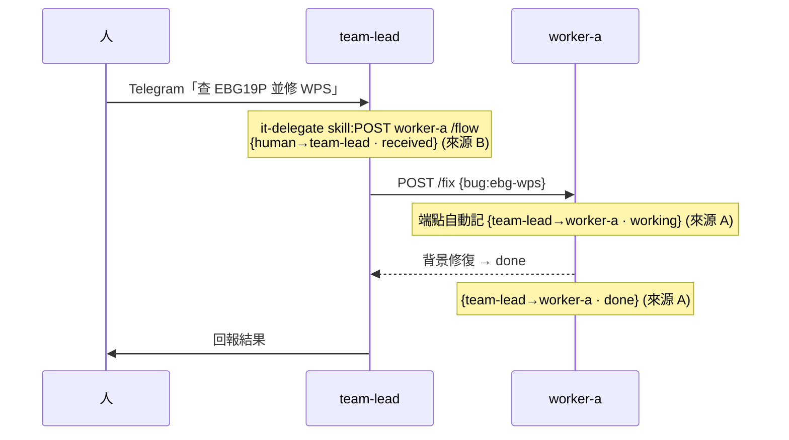

# 活動流視覺化規格 — 即時跨節點工作流(Flow)

_已實作(worker /flow + dashboard 合併 + SPA Flow 視圖 + team-lead intake hop);本文件為完整規格。_

讓 GUI 即時顯示「誰委派誰、正在做什麼、狀態」—— 例如 **human → team-lead(收件)→ worker-a(working）→ done → team-lead(回報)→ human**。設計原則:**只記真實工作/交接,不記 dashboard 的 GET 輪詢**(否則洗版);盡量走既有通道(免新 egress)。

---

## 1. 事件 schema

每個 flow 事件:
```json
{ "ts": "14:22:07", "node": "worker-a", "peer": "team-lead",
  "task": "ebg-wps remediation", "status": "working|done|fail|error|received", "detail": "…" }
```
- `node` = 動作發生在誰身上;`peer` = 誰委派/來源(方向 = `peer → node`)。
- `status`:`received`(收件)/ `working`(執行中)/ `done` / `fail` / `error`。

---

## 2. 事件來源(4 個捕捉點)

| # | 捕捉點 | 記在哪 | 型態 | 捕捉什麼 |
|---|---|---|---|---|
| **A** | worker 端點的**真實委派**:A2A `message/send`、`/fix`、`/monitor-scan`、`/nuclei-scan` | worker 記憶體 `FLOW` ring(GET `/flow`) | 確定性(程式) | `team-lead → worker-X · task · working/done` |
| **B** | **team-lead 收件**(Telegram/Email → team-lead) | team-lead 委派前 `POST worker/flow`(走既有 bridge) | LLM skill 記(`it-delegate-worker`) | `human → team-lead · <需求> · received` |
| **C** | **GUI 人為動作**(dashboard 按鈕:rescan/patrol/…) | host `data/flow-log.jsonl`(`_flow_append`) | 確定性(host) | `human → worker-b · CVE rescan (GUI) · working` |
| **D** | **team-lead 主動巡邏/回報** | host `proactive-status.json` → collect 合成 | 確定性(host) | `team-lead → human · patrol · done` |

**為何 worker GET 掃描端點(/cve /monitor…)不記**:那是 dashboard 每輪輪詢拉來顯示的,不是「工作流」;記了會被輪詢洗版。只記 POST/委派/觸發。
**為何 B 走 worker `/flow` 而非直接打 dashboard**:team-lead 已有 worker 的 bridge 存取(token + `/32`),重用它 → **免開 team-lead→dashboard 新 egress**。team-lead 事件帶 `node:"team-lead"`,dashboard 依 `node` 正確歸屬。

---

## 3. 聚合(dashboard `collect()`)

```
d.flow = merge(
    worker-a /flow, worker-b /flow,   # 來源 A + B(B 的 team-lead 事件混在 worker ring,靠 node 欄位歸屬)
    host data/flow-log.jsonl,         # 來源 C(GUI 動作)
    proactive-status → team-lead 事件 # 來源 D
) 依 ts 反序,取最近 30 筆
```

- worker `/flow`:`_worker_get(frag, "/flow")`(短 timeout,回快取 ring,零掃描成本)。
- host flow-log:`_flow_append` 寫、collect 讀(ring 60 / 顯示 30)。

---

## 4. GUI(SPA **Flow** 視圖)

- **Fleet activity 條**:team-lead / worker-a / worker-b 三節點卡;有 `working` 事件的節點**亮起**(邊框 accent + ● working)。
- **Delegation timeline**:`DataTable`,每列 = `time · peer → node · task[+detail] · status pill`。
- 透過既有 `NF.subscribe`(輪詢→未來可換 WS/SSE)即時更新;transport seam 已在 `api.js`。

---

## 5. 端點契約

**worker `:9099`**
- `GET /flow`(authed)→ `{ "flow": [最近 40 筆] }`。
- `POST /flow`(authed;ingest)→ body `{node,peer,task,status,detail}` → 記入 FLOW ring。給 team-lead 記 intake/report 用。

**dashboard**
- `collect()` 產 `d.flow`;GUI 動作在 `do_action` 內 `_flow_append`(host 端,不需外部 POST)。

---

## 6. 完整捕捉的一條鏈


Flow 視圖依序顯示:`human → team-lead(received)` → `team-lead → worker-a(working)` → `done`。

---

## 7. 擴充

- **worker-c review-gate**(見 [worker-c-spec.md](./worker-c-spec.md)):審查/退回/重做事件用**同一個** `flow()` 記 —— `team-lead → worker-c · review · working`、`worker-c → worker-a · reject/redo`。Flow 視圖自動涵蓋品質閘的來回。
- **真即時**:目前 5s 輪詢;`api.js` 的 `subscribe` seam 可換 WebSocket/SSE,worker 事件即時推播(UI 不用改)。
- **持久化/回放**:host flow-log 已落地;可加保留期 + 「回放某段時間的工作流」視圖。
