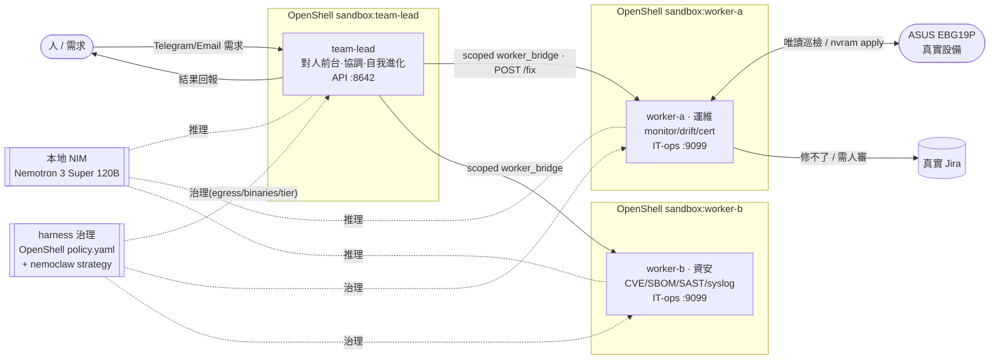

# nemofleet 架構 — team-lead + workers(單一 Hermes harness,由 harness 治理)

_更新 2026-07 — 三節點同型 Hermes 艦隊 · 本地 Nemotron 3 Super 120B_

三個節點**都跑 Hermes harness**、都在本地 **NVIDIA NIM(Nemotron 3 Super 120B-A12B)** 上推理,只差角色/設定:
team-lead 對人前台 + 協調,worker-a / worker-b 執行維運。唯一受管的真實設備 = ASUS ExpertWiFi **EBG19P**。

## Mermaid


## ASCII(投影片用)
```
  人 ──需求(Telegram/Email)──►  team-lead(對人前台·協調)
       ◄────────結果回報────────    │  scoped worker_bridge (/32 + token) · POST :9099/fix
                                      ├─► worker-a · 運維  ──唯讀巡檢 / nvram apply──► [ASUS EBG19P]
                                      │     monitor / drift / cert          修不了·需人審 ──► 真實 Jira
                                      └─► worker-b · 資安
                                            CVE / SBOM / SAST / syslog
  三節點都是 Hermes harness · 都在本地 NIM(Nemotron 3 Super 120B)推理 · 各自獨立 OpenShell 沙箱
  ┌── harness 治理 ──┐  OpenShell policy.yaml(egress / binaries / host)
  │  誰能做什麼 / 去哪 │  + nemoclaw strategy(model / route / policy tier) → log ALLOWED/DENIED(code, not prompt)
  └────────────────────┘
```

## 角色分工
- **team-lead(對人前台 + 協調 + 自我進化 + 主動巡邏)**:接 Telegram / Email 需求、規劃、解釋、回報;把重複模式寫成 SKILL.md;判型後委派給 worker。介面 = OpenAI 相容 API `:8642`。
  另有**積極主動**面(`scripts/teamlead-proactive.sh` + `skills/hermes/proactive-fleet-patrol`):定期主動叫 worker 掃描、偵測設備狀態/錯誤 delta,並用自己的口吻主動推 Telegram/Email 回報(不等人問;critical 即時、routine 併日報,尊重靜音時段)。
- **worker-a(運維)**:設備狀態巡檢、設定漂移(drift)比對、憑證 / 弱加密盤點、對 **EBG19P** 的確定性 remediation(nvram apply + 重讀驗證)。
- **worker-b(資安)**:定期 CVE 掃描、上游韌體原始碼 SBOM / SAST、syslog 分析。
- **推理**:三節點都路由到本地 **NIM(Nemotron 3 Super 120B-A12B,原生 NVFP4、hybrid Mamba-MoE、agent / tool-use 特化)**;端點見 `inference.local`(gateway `:18080`)。
- **跨節點通道**:唯一互通面 = scoped `worker_bridge` policy(/32)+ worker 的 `:9099` IT-ops 端點(X-Bridge-Token)。此端點同時提供**標準 A2A(Agent2Agent)介面** —— Agent Card 能力發現(`/.well-known/agent-card.json`)+ JSON-RPC `message/send` 委派(`services/bridge/a2a_client.py`),**over 同一條受治理通道**(標準協定 + OpenShell 治理兼得)。team-lead 委派、worker **確定性執行**(零 LLM 掃描 + 設備 remediation);修不了 / 需人審 → 開**真實 Jira**。拓撲為 hub-and-spoke(worker 之間不互通)。host 端另有 `dispatch` / `collab` / `bus` 作備援驅動。
- **共享知識層**:`knowledge/`(核准 baseline + 安全鍵定義)是**單一權威來源**,`services/bridge/knowledge.py` 載入 —— worker-a 的 drift 偵測與 team-lead 讀的是**同一份**(team-lead 經 `GET /knowledge`(A2A skill `knowledge`)即時拉;boot 同步到每台 worker)。`version` hash 讓全隊確認在同一版知識上,解「context 不一致」這個多 agent 頭號失敗。完整 MCP client 掛載是其上的升級路徑。
- **harness 治理層**:OpenShell `policy.yaml`(egress / binaries / host 三層)+ nemoclaw strategy(model / route / policy tier)—— 程式碼層強制,由 log `ALLOWED` / `DENIED` 佐證。

## 即時 demo 亮點(可選)
team-lead 內建 `creative/architecture-diagram` 技能,demo 時可現場請它產一張 SVG 架構圖,展示「自我進化」的實際產出。
