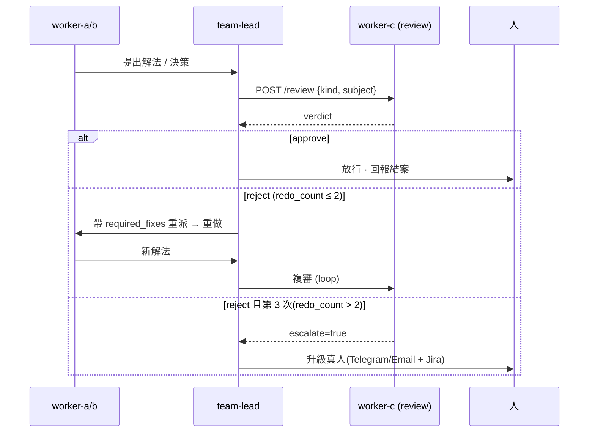
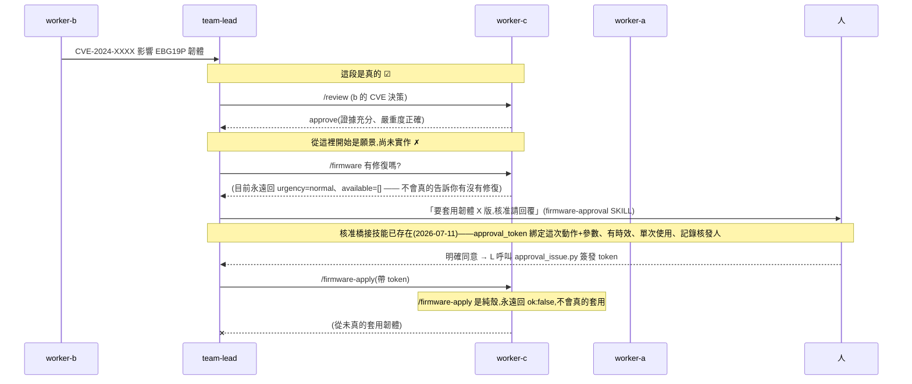

# worker-c 設計規格 — 變更治理官(release manager + QA 監督)

_第四個 worker,zone C。**已實作且穩定**:① review 監督(`wi_review` 純函式閘 + zone C 端點/A2A,單元測試 + 整合測試驗過)② SkillOS 技能庫策展(`wi_skills`,同樣純函式閘,見第 9 節)③ 可部署(CT_WC + boot-stack + `review-gate` skill + healthcheck)④ 進 console(Flow 節點 + Change control 面板)。**backup/rollback 對真機可動,但沒有讀回驗證;firmware 的 stage/apply 兩步生命週期只有 `/firmware-apply` 的殼、尚未真的接上任何下載/驗簽/套用邏輯**;review 的 LLM 判斷層仍是純構想,尚未開工。本文件對照目前實作逐節校正過(2026-07-10),不是最初設計時的願景版。_

worker-c 是「**已知良好狀態的守門人**」:一面掌管**生命週期**(備份 / 韌體 / rollback),一面當 worker-a、worker-b 的**品質閘門** —— 審查它們的解法/決策,爛的可退回重做,**外加**team-lead 自己新寫的技能也要先過它的策展閘。三個角色是同一件事的三面:它定義「什麼是好狀態、什麼變更准放行、什麼技能夠格留下」。

沿用現有 pattern:新 OpenShell 沙箱跑 Hermes(同一顆 NIM)+ zone C 能力 + `:9099` 端點 + A2A skills。team-lead 經 A2A 自動發現它、把它織進 review-gate 流程。**worker 之間仍不直接互連** —— 監督權威透過 team-lead 仲裁執行。

---

## 1. 能力矩陣(`ZONE_CAPS["C"]`,`worker-itops.py`)

| cap | 職責 | 型態 | 實作狀態 |
|---|---|---|---|
| `backup` | 設定快照 / 版本歷史 | 確定性 | ☑ 對真機可動(需 `EBG19P_CRED`),排程預設每 24h(`BRIDGE_BACKUP_INTERVAL`),自動保留最新 15 筆(`backup_retain_count`,超過砍最舊) |
| `firmware` | 韌體版本查詢 | 確定性(唯讀) | ◐ `GET /firmware` 只回目前版本,`urgency`/`available`/`cve_driven` 都是寫死的空值/`"normal"`,並未真的接 worker-b 的 CVE 結果 |
| `rollback` | 還原已知良好設定 | 確定性 · **需 approval_token** | ◐ 對真機可動,但**沒有還原後讀回驗證**;`approval_token` 現在是每次核發、綁定 `{"to": ...}` 參數、有時效、單次使用、可追溯核發人的真 token(見第 7 節) |
| `review` | 審查 a/b 產出 → 綁定判決(approve/reject) | 確定性閘 | ☑ 完整實作,見第 3 節 |
| `curate` | SkillOS 技能庫策展(insert/update/delete 的品質 + 防重複閘) | 確定性閘 | ☑ 完整實作,見第 9 節(**原規格未提及此能力**) |

`/firmware-stage`(下載 + 驗簽 + canary 計畫)**不存在**——曾經是本文件的設計,但程式碼裡從未寫過,`grep` 全庫查無此字。`/firmware-apply` 目前是純殼:永遠回 `{"ok": false}`,不論有沒有帶 `approval_token`,也不會真的對裝置動作。

---

## 2. 端點契約(`:9099`,全部 X-Bridge-Token 認證)——附實際回應範例

### `GET /backup`
- 回:`{"count": N, "backups": ["bk-<ts>", ...][:20], "dir": BACKUP_DIR}`
- **注意**:`backups` 是純 id 字串陣列,**不含每筆的 metadata**(沒有個別的 sha256/ts/trigger)。

### `POST /backup`
- 對 EBG19P 匯出目前設定,存版本化快照。
- 回:`{"available": true, "latest": "bk-<ts>", "ts": ..., "keys": N, "sha256": "..."}`;無裝置憑證時優雅降級 `{"available": false, "note": "...", "ts": ...}`。
- **沒有 `diff_from_prev`**(無 diff 邏輯)、**沒有 `size`**、**沒有 `asset`**、**沒有把 `trigger` 回傳給呼叫端**(只存在寫入磁碟的那份 JSON 裡)。
- **沒有「每次 remediation 前後自動各拍一張」的掛鉤** —— 目前唯一的自動觸發是背景排程迴圈(`_backup_schedule_loop`,預設 86400s),`run_ebg_remediate`(worker-a 的修復路徑)完全沒有呼叫這裡的備份邏輯。
- **自動保留數量上限**(2026-07-12 新增):每次成功寫入新快照後,`_prune_backups()` 會依 `backup_retain_count`(預設 15,`BRIDGE_BACKUP_RETAIN`;`0` = 不砍、無上限)砍掉最舊的檔案——檔名 `bk-YYYYMMDD-HHMMSS.json` 本身可字串排序,不需要另外讀取每筆的時間戳。不論是排程觸發還是 API 觸發都會跑這段,不是只有排程備份才砍。

### `GET /firmware`
- 回:`{"current": "<目前版本或 unknown>", "available": [], "urgency": "normal", "cve_driven": [], "note": "ASUS 韌體來源未設定...", "note_en": "..."}`
- `available`、`cve_driven` 永遠是空陣列,`urgency` 永遠是 `"normal"` —— **這三個欄位目前都是寫死的**,韌體來源(下載/查版本)從未接上,worker-b 的 CVE 結果也沒有被讀取拿來算 urgency。
- Dashboard 上看到的「CVE 驅動的 urgency」其實是**前端自己算的**(`app.js` 用 `d.cve.findings` 交叉比對顯示紅點),不是這支端點回的資料本身有這個邏輯。

### `POST /firmware-apply`
- 回:`{"ok": false, "note": "韌體套用需 approval_token + 韌體來源 egress(見 worker-c-spec §2/§7)", "note_en": "...", "approval_token": <bool>}`
- **這是純殼**。永遠 `ok: false`,不論 `approval_token` 是否正確;不檢查 zone、不讀裝置憑證、不下載、不驗簽、不套用、不驗證。程式碼裡沒有任何一條路徑真的把韌體寫進裝置。`approval_token` 欄位回真的核准驗證結果(綁定 body 裡除 `approval_token` 外的其餘欄位當 params,見第 7 節),但因為整支是殼,目前只有展示意義——沒有真正的動作可以被這個核准保護。

### `POST /rollback`
- 入:`{"to": "bk-<id>", "approval_token": "<單次核發、綁定 to、有時效的 token,見第 7 節>"}`
- 讀該備份的存檔設定,呼叫真機 `c.apply("restart_all", ..., wait=15)`。
- 回:`{"ok": true, "restored_to": to, "keys": N, "ts": ...}`,或失敗時 `{"ok": false, "error": "...", "error_en": "..."}`。
- **有 `verify` 讀回驗證欄位(2026-07-13 加)** —— 套用後會重讀每個還原的鍵、確認裝置真的回到目標值,回 `{"verified": bool, "verify": {checked, match, mismatch, inconclusive}}`。`inconclusive`(讀不到)不算失敗,而是 EBG19P 單一 session 被 host streamer 搶走(跟 worker-a remediation 同一套「每回合重登再批次讀」的做法)。`ok`(有沒有套用)與 `verified`(有沒有讀回確認)是分開的兩件事。結果落地 `rollback-history.jsonl`,`GET /rollbacks` 給 GUI 的 Change control「Rollbacks」面板顯示。

### `POST /review` —— 監督核心(內容與原規格一致,見第 3 節)
- 入:`{"kind": "remediation|cve|source", "subject": <被審的 a/b 產出>}`(目前實作沒有 `"health"` kind,也沒有 `target`/`context` 參數,呼叫端不需要傳)。
- 回綁定判決(結構同原規格,現在每個 check 都多帶一個 `detail_en`,`reasons`/`required_fixes` 也都各有 `_en` 版本):
```json
{
  "verdict": "approve | reject",
  "score": 0-100,
  "target": "worker-a", "kind": "remediation",
  "checks": [ {"name": "baseline-match", "pass": true, "detail": "...", "detail_en": "..."}, ... ],
  "reasons": [...], "reasons_en": [...],
  "required_fixes": [...], "required_fixes_en": [...],
  "redo_count": 1, "escalate": false
}
```

### `POST /skill-review` · `GET /skills` · `GET /curations` —— SkillOS 策展(原規格完全沒提到,見第 9 節)

### `GET /reviews`
- 回最近 30 筆 `/review` 判決紀錄(給 console 的 Change control 面板用),原規格未提及此端點。

---

## 3. `/review` 判準(確定性閘,LLM 判斷層尚未開工)

先跑**確定性 gate**;全過才 approve。**目前完全沒有 LLM 判斷層** —— `wi_review.py` 自己的檔頭註解就寫明:「Deterministic gates only; the LLM nuance ... is a team-lead / worker-c-agent layer on top」,這句話是「還沒做」的意思,不是「已經做了一部分」。判準都錨定既有的共享知識層(baseline / 安全鍵)。

**remediation(審 worker-a)** — `wi_review.review_remediation`,4 閘:
- ☑ `verified`:worker-a 有實跑重讀 + 帶 `ok` / `after`(非空談)。
- ☑ `baseline-match`:被標記的安全鍵,修完的 `after` 等於**已核准 baseline**。
- ☑ `success-consistent`:回報 `ok=true` 卻仍偏離 baseline = 擋。
- ☑ `scope`:**只在呼叫端有給 `before` 和 `target_key` 時才跑**;沒給就略過此閘(不算失敗,單純不檢查)——呼叫端要注意這點,不是每次都保證有 4 個 check。
- ◇ `root-cause` / `no-better-alt`(LLM 擴充,未實作):修的是根因嗎?有無更完整/更安全的作法被漏掉?

**cve / source(審 worker-b)** — `wi_review.review_cve`,最多 3 閘、實際筆數依輸入而定:
- ☑ `evidence`:affected 判定有元件 + 版本佐證。
- ☑ `cve-id`:判 affected 有附 CVE id。
- ☑ `version-consistent`:**只在 `verdict=="affected"` 且同時給了 `fixed_version` 與 `our_version` 時才跑**;否則這個 check 根本不在 `checks` 陣列裡 —— 也就是說,一筆判定 `not_affected` 的 subject,審查只會跑 2 個閘,不是原規格暗示的固定 3 閘。
- ◇ `false-pos/neg` / `severity`(LLM 擴充,未實作)。

**沒有 `"health"` kind** —— `review(kind, subject, ...)` 的統一入口目前只認得 `remediation`/`cve`/`source`;其他 kind(含 `health`)一律直接 `approve`,`note: "無對應審查閘,放行"`(即 fail-open,不是有專門的 liveness/error-rate 判準)。

---

## 4. redo_count / escalate(`wi_review.annotate_redo`)

- `redo_cap` 預設 `2`。同一 `(kind, subject_ref)` 累積被 reject 次數 `redo_count`;**`escalate = redo_count > redo_cap`**,也就是**第 3 次被拒才升級**,不是第 2 次。（本文件先前版本的循序圖標成「`redo_count ≥ N`」,對照 N=2 會讓人以為第 2 次就升級 —— 以程式碼行為為準:第 3 次。）
- escalate 時 `required_fixes`/`required_fixes_en` 會被覆寫成制式訊息:「重做已達上限,停止重派,升級真人」。
- **redo 歷史是純記憶體狀態**(`worker-itops.py` 的全域 `REVIEWS` list,只留最近 40 筆),**worker-c 的沙箱一重啟,所有升級計數就歸零** —— 沒有落地持久化,這點原規格沒提到,是實務上的已知限制。

---

## 5. team-lead review-gate 流程(權威怎麼執行)

worker-c 的 **reject 是政策上綁定的** —— team-lead 收到 reject **必須**重派,不能放行。c 不直接連 a/b,由 team-lead 當傳輸,維持 hub-and-spoke。



實作 = team-lead 一支 SKILL `review-gate`:**接受任何 a/b 解法前,先過 worker-c**。

---

## 6. 權威模型 & 護欄

| 護欄 | 規則 | 實作狀態 |
|---|---|---|
| **重做上限** | 第 3 次仍不過 → 升級真人(不無限迴圈) | ☑ |
| **判決可稽核** | 每個 verdict 進既有 tamper-evident audit chain | ◐ `/review`/`/skill-review` 的判決有記進 in-memory 的 `REVIEWS`/`CURATIONS` ring(供 console 顯示),**但沒有寫進 `agent-dashboard.py` 的 tamper-evident audit chain**(那條鏈目前只收 admin 操作,不收 worker-c 判決) |
| **c 的高風險動作要人核准** | `firmware-apply` / `rollback` 需 `approval_token` | ☑ 每次核發、綁定動作+參數、有時效、單次使用、可追溯核發人(`wi_approval.py` + `firmware-approval` SKILL,見第 7 節)。未被密碼學保證的環節:team-lead 是否真的先問了人(見第 7 節結尾誠實說明) |
| **人可覆寫** | 品質層級:人 > c > a/b | ☑(架構上成立;approval_token 現在綁定到具體動作內容 + 單次使用,粒度到位) |

階層:**人 = 最終權威**;**team-lead = 協調 + 執行 c 的判決**;**worker-c = 品質/變更權威**;**a/b = 執行**。這個階層現在有一層真的技術控制:`approval_token` 每次核發都綁定具體動作內容、有時效、單次使用、記錄核發人(見第 7 節)——唯一仍未被密碼學保證的環節是「team-lead 有沒有真的先問人」,那一段是 SKILL 流程的約定,不是 token 驗證能強制的。

---

## 7. `approval_token` —— 現在是真的核准機制(2026-07-11 更新)

**演進**:原本是純字串真值檢查,任何非空值都算「核准」(安全審查 finding #2)→ 升級成單一共享密鑰的 `hmac.compare_digest` 比對(fail-closed,但不綁定特定動作,任何拿得到密鑰檔案的呼叫都能核准任何一次 rollback)→ **現在是每次核發、綁定動作+參數、有時效、單次使用、可追溯核發人的真 token**(這一版,見下方)。

```python
# wi_approval.py(worker-c 端驗證 verify(),team-lead 端簽發 issue() —— 同一支模組,兩邊各自 docker cp 一份)
def issue(action, params, issuer, key, ttl_s=300):
    payload = {"act": action, "params_hash": sha256(canon(params)), "iss": issuer,
               "iat": now(), "exp": now() + ttl_s, "nonce": token_hex(16)}
    return b64u(payload) + "." + hmac_sha256(key, b64u(payload))

def verify(token, action, params, key, seen_nonce):
    # 簽章、動作是否相符、params_hash 是否相符、是否過期、nonce 是否已用過 —— 任一項不過就拒絕
    ...
```

`worker-itops.py` 的 `run_rollback` 呼叫 `_approval_verify_and_record(token, "rollback", {"to": to})`;`/firmware-apply`(仍是純殼)呼叫同一支函式,綁定 body 裡除 `approval_token` 外的其餘欄位當 params。通過後,`_approval_verify_and_record` 把 `{nonce, act, params, issuer}` 寫進 `WD/approval-history.jsonl`——worker-c 這端的稽核紀錄,同時拿它擋 nonce 重放(單次使用)。

**相對於前一版「共享密鑰」補的缺口**:
- **綁定動作 + 參數**:token 帶著參數的 canonical-JSON sha256(`params_hash`),`verify()` 重算比對——核准「rollback 到 `bk-A`」的 token,拿去呼叫「rollback 到 `bk-B`」會被拒絕(見 `tests/unit/test_endpoint_logic.py::TestRunRollbackValidation::test_token_approved_for_a_different_backup_id_is_rejected`)。
- **有時效**:預設 `ttl_s=300`(5 分鐘),超過 `exp` 一律拒絕。
- **單次使用**:token 帶隨機 `nonce`,用過就記進 `approval-history.jsonl`,同一個 token 不能重放第二次。
- **可追溯核發人**:`issuer` 是核准的人類身分(例如 Telegram username),不是節點名,連同動作/參數/時間一起進稽核紀錄。

**核發方**:`services/bridge/approval_issue.py`,`boot-stack.sh` 部署進 team-lead 的 sandbox——用跟 SKILL.md 渲染 `BRIDGETOKEN` 一樣的手法(`sed` 把 `APPROVAL_KEY` 直接烤進這支腳本再 `docker cp`),不是設環境變數,因為 team-lead 的技能執行不是像 zone 容器那樣的單一長駐行程,環境變數注入不到 LLM 之後每次獨立 `docker exec` 的工具呼叫裡。呼叫方式與核准流程寫在 `skills/hermes/firmware-approval/SKILL.md`;`review-gate/SKILL.md` 第 5 步現在指向這支技能,不再只是一句提示文字。

**誠實地說,仍有一個環節不是密碼學能保證的**:token 驗證只能證明「這個 token 對應到一組被正確簽過名、還沒過期、還沒用過的 (action, params, issuer)」,**不能**證明 `approval_issue.py` 真的是在人類實際於 Telegram 回覆同意之後才被呼叫——先問人、等到明確同意才簽發,完全是 `firmware-approval` SKILL 對 team-lead 這個 LLM 的行為約定。這跟舊版 `_approved()` 的信任邊界性質相同:**worker-c 保證的是「沒有正確簽名/綁定/時效/單次的 token 一律擋」,不保證「team-lead 有沒有先誠實地去問人」**。要把這一段也變成系統層級強制,需要一個 team-lead 自己繞不過去的外部見證機制(例如核准動作由人在 Telegram 端點按鈕、webhook 直接觸發簽發,team-lead 完全不經手核准判斷本身)——目前沒有做到這一步,不要在 demo 或對外文件裡宣稱「人核准」已經是密碼學強制的系統控制點,它仍然部分依賴 team-lead 的行為誠實。

---

## 8. A2A(Agent Card,zone C)

`GET /.well-known/agent-card.json` 由 `wi_a2a.build_agent_card(...)` 產生,zone C 目前廣播 **5 個** capability(`ZONE_CAPS["C"]`):`backup`、`firmware`(skill id `firmware-update`)、`rollback`、`review`、**`curate`**。

**跟本文件先前版本的落差**:
- 先前版本把 review 拆成兩個 skill id(`review-remediation`/`review-cve`)——實際上**只有一個統一的 `review` skill**,`kind`(`remediation`/`cve`/`source`)是呼叫時放進 body/metadata 的參數,不是兩個獨立的 A2A capability。
- 先前版本完全沒列 `curate` —— 這是真實存在、team-lead 也會用到的第 5 個能力(見第 9 節),不是筆誤,是規格漏了整個能力。

team-lead 用 `message/send` 委派;高風險 skill(`rollback`)在 metadata 帶 `approval_token`,worker-c 端做第 7 節那樣的驗證(簽章 + 動作/參數綁定 + 時效 + 單次使用,fail-closed)。

---

## 9. SkillOS 技能庫策展(`curate`)—— 先前版本完全沒有這節

worker-c 的第三個身分:**team-lead 自己新寫的技能,要先過 worker-c 這關,才能真的落地**。改編自 SkillOS("Learning Skill Curation for Self-Evolving Agents", arXiv 2605.06614):凍結的 executor(retrieve + 用技能)配一個可訓練的 curator(insert/update/delete,依品質訊號把關)。這裡沒辦法真的 RL 訓一個 curator,所以把 curator 的**品質閘門**部分做成確定性、單元測試過的純函式(`wi_skills.py`,123 行),外加 BM25 檢索。

**`skill_quality(text)`** —— 4 個確定性閘,審一份 Markdown + YAML frontmatter 技能:
- `frontmatter`:有 `name` + `description`。
- `name-format`:`name` 是 kebab-case。
- `has-body`:指令內容 ≥ 20 字元。
- `concise`:內文 ≤ 120 行(超過視為疑似逐字複製 SkillOS 訓練軌跡,SkillOS 的 compression 機制建議壓縮)。

**`curate(op, text, existing, name)`** —— 三種操作的綁定判決:
- `delete`:只檢查該技能是否存在於庫中。
- `insert`:跑完 4 個品質閘,再加一個 `non-redundant` 閘 —— 用 Jaccard token overlap 跟現有每一份技能的內文比對,重疊度 ≥ 0.6(`dup_threshold`)就 reject,建議改用 `update` 而非新增(防止技能庫無限膨脹)。
- `update`:同 `insert` 的品質閘(不跑防重複檢查)。
- 任一閘沒過 → `verdict: "reject"`,`required_fixes` 附上具體怎麼修。

**`bm25_search(query, skills)`** —— 真的 BM25(`k1=1.5, b=0.75`),取分數最高前 5 筆,供技能檢索用。

**端點**:`POST /skill-review`(`{op, name, text}` → 判決,結構同 `/review`)、`GET /skills`(列出所有技能名稱,帶 `?q=` 時做 BM25 檢索,回 `{query, results: [{name, score}]}`)、`GET /curations`(最近 30 筆策展判決,console 用)。

**跨節點整合點**(這段目前只寫在 `lib/common.sh`,不在本文件):`lib/common.sh` 的 `skill_gate()` 是 team-lead 自我進化(寫新技能)的把關機制 —— 新技能落地前一定先 POST 到 worker-c 的 `/skill-review`,reject 就是綁定不准落地。**worker-c 未部署或不可達時 fail-open**(放行但記警告),避免治理節點沒起來就卡死整個自我進化流程。

**部署細節**:`boot-stack.sh` 只在 `zone == "C"` 時,把整個 `skills/` 目錄 `docker cp` 進沙箱(`/usr/local/share/nemofleet-skills`)並設定 `SKILLS_REPO` 環境變數 —— 這是 worker-c 專屬的部署步驟,原規格第 8 節完全沒提到。

---

## 10. Egress & 治理 —— 韌體來源這塊尚未動工

- **裝置**:worker-c → EBG19P(備份匯出 + rollback 套用)—— 同 worker-a 的 `/32` allow,已生效。
- **韌體來源**:規劃中要 scoped allow 到 ASUS 韌體 host(下載 + 驗簽),但 **`scripts/worker-c-allow-firmware.sh` 這支腳本不存在**,`boot-stack.sh` 也沒有任何呼叫它的地方。跟第 2 節的 `/firmware-apply` 是殼互相呼應 —— 因為從沒真的要下載韌體,這個 egress preset 自然也還沒被寫出來。
- **備份庫**:本地 `WD` 下的版本化 JSON 快照;備份含設定 → 視為敏感,應加密存放、git-ignored(**目前的快照檔案是否已加密尚待確認,不在此次程式碼審查範圍內**)。
- 所有 egress 仍走 OpenShell L7 deny-by-default。

---

## 11. 部署(已存在的 worker-c,重建/加一台時的實際步驟)

1. 建 OpenShell 沙箱 `worker-c`(zone C),同 Hermes + NIM。
2. `lib/common.sh`:`WORKERC_CT_NAME` / `CT_WC`(已生效)。
3. `worker-itops.py`:`ZONE_CAPS["C"] = {"backup","firmware","rollback","review","curate"}` + 對應端點(已生效)。
4. `boot-stack.sh` 對 zone C 額外做的事:
   - `docker cp` `wi_review.py`、`wi_approval.py` 模組進沙箱。
   - **只有 zone C** 會把整個 `skills/` 目錄 sync 進沙箱(`SKILLS_REPO`),供 SkillOS 策展讀取——這步驟原規格未提及。
   - `zone in ("A","C")` 時注入 `EBG19P_CRED`(worker-c 需要裝置憑證做 backup/rollback)。
   - 產生/注入 `APPROVAL_KEY`(僅 zone C;`services/bridge/.approval-key`,跟 `.bridge-token` 同模型:host 產生、chmod 600、git-ignore)。
   - **不會**套用任何 `worker-c-allow-firmware` 之類的韌體來源 egress(該腳本不存在)。
5. team-lead 裝 `review-gate` + `firmware-approval` 兩支 SKILL(都在 `skills/hermes/`)——`firmware-approval` SKILL 現在存在,人核准走它,而不是 `review-gate` 裡的一行提示文字。`boot-stack.sh` 額外把 `approval_issue.py` + `wi_approval.py`(嵌入 `APPROVAL_KEY`)docker cp 進 team-lead 的 sandbox(`/sandbox/.hermes/workspace/it-task/`)。
6. 完成 → team-lead 經 A2A 自動發現 worker-c 的 5 個技能(含 `curate`),巡邏/委派自動納入;`lib/common.sh` 的 `skill_gate()` 也會自動對新技能生效。

---

## 12. 旗艦協作鏈 —— 目前哪一段是真的、哪一段是願景

原規格描述的這條鏈(CVE 發現 → review → 韌體 stage → 人核准 → apply → verify → rollback if needed)**目前只有前兩段是真的**:



**要把這條鏈接成真的**,依實作難度大致排序:
1. ~~`/firmware` 真的讀 worker-b 的 CVE 結果算 `urgency`/`cve_driven`~~ —— **已完成**(2026-07-13):在 dashboard 聚合層算(worker-c 依隔離讀不到 worker-b),依 CVE 嚴重度算 urgency,Governance 韌體面板顯示受影響 CVE。
2. 寫 `scripts/worker-c-allow-firmware.sh`,做真的韌體來源 egress。
3. 實作 `/firmware-stage`(下載 + 驗簽)與真的 `/firmware-apply`(套用 + 讀回驗證 + 失敗自動 `/rollback`)。
4. ~~幫 `rollback` 加讀回驗證(`verify` 欄位)~~ —— **已完成**(2026-07-13,見第 2 節 `/rollback`:`_rollback_readback` + `rollback-history.jsonl` + `GET /rollbacks` + GUI 面板)。
5. ~~`approval_token` 升級成細粒度核准(單次簽發、綁定特定動作內容、有時效、可追溯核發人)~~ ——
   **已完成**(見第 7 節,2026-07-11:`wi_approval.py` + `firmware-approval` SKILL)。剩下不是密碼學能保證的
   環節見第 7 節結尾:「team-lead 是否真的先問了人」仍是行為約定,不是 token 驗證能強制的;要補這段
   需要人在 Telegram 端點按鈕、webhook 直接觸發簽發(team-lead 完全不經手核准判斷本身)這類外部見證機制。

在那之前,「discover → review → fix+stage → 人核准 → apply → verify → rollback」這條完整故事,**只有 discover、review、人核准(token 簽發/驗證)三段可以在真機上展示**,`fix+stage`/`apply`/`verify`/`rollback` 的讀回驗證仍是設計目標,不要當成已出貨的能力來 demo 或承諾。
