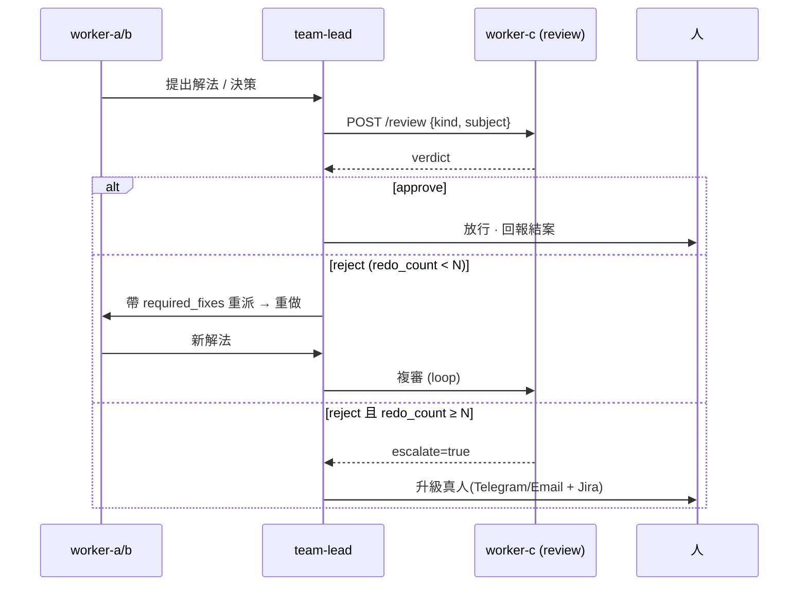

# worker-c 設計規格 — 變更治理官(release manager + QA 監督)

_第四個 worker,zone C。**已實作 Stage 1–3**:① review 監督(wi_review 純函式閘 + zone C 端點/A2A,沙箱 + CI 驗過)② 可部署(CT_WC + boot-stack + `review-gate` skill + healthcheck)③ 進 console(Flow 節點 + collect)。**lifecycle(備份/韌體/rollback)結構完成、對真機操作待實機驗證**;review 的 LLM 判斷層為擴充。_

worker-c 是「**已知良好狀態的守門人**」:一面掌管**生命週期**(備份 / 韌體 / rollback),一面當 worker-a、worker-b 的**品質閘門** —— 審查它們的解法/決策,爛的可退回重做。兩個角色是同一件事的兩面:它定義「什麼是好狀態、什麼變更准放行」。

沿用現有 pattern:新 OpenShell 沙箱跑 Hermes(同一顆 NIM)+ zone C 能力 + `:9099` 端點 + A2A skills。team-lead 經 A2A 自動發現它、把它織進 review-gate 流程。**worker 之間仍不直接互連** —— 監督權威透過 team-lead 仲裁執行。

---

## 1. 能力矩陣(ZONE_CAPS["C"])

| cap | 職責 | 型態 |
|---|---|---|
| `backup` | 設定快照 / 版本歷史 / diff | 確定性 |
| `firmware` | 韌體版本追蹤 · 更新查核 · 分批(canary)上線 | 確定性 + 治理 egress |
| `rollback` | 還原已知良好設定 | 確定性 · **需人核准** |
| `review` | 審查 a/b 產出 → 綁定判決(approve/reject) | 確定性閘 + LLM 判斷 |

---

## 2. 端點契約(`:9099`,全部 X-Bridge-Token 認證)

### `POST /backup` · `GET /backup`
- `POST` → 立即對 EBG19P 匯出 nvram/settings,存版本化快照。
- 回：`{ "id": "bk-<ts>", "asset", "ts", "sha256", "size", "diff_from_prev": {added, removed, changed}, "trigger" }`
- `GET` → 列最近 N 個備份 + 最新一筆 metadata。備份**每次變更前後**自動各拍一張(供 rollback 錨點 + 變更歸因)。

### `GET /firmware` · `POST /firmware-stage` · `POST /firmware-apply`
- `GET` → `{ "current": "3.0.0.6.102_45537", "available": [...], "urgency": "high|normal", "cve_driven": ["CVE-…"], "staged": null }`
  - `urgency` 由 **worker-b 的 CVE 結果**驅動:某 CVE 有韌體修復 → high。
- `POST /firmware-stage` → 下載 + 驗簽 + 產 canary 計畫(先一台/一時段)。回 `{ "staged": {version, sha256, plan} }`。
- `POST /firmware-apply` → 套用**已 stage** 的韌體。**需 `approval_token`(人核准)**,否則 403。套用後自動跑 health-verify;失敗 → 自動 `/rollback`。

### `POST /rollback`
- 入:`{ "to": "bk-<id>", "approval_token" }`(**需人核准**)。
- 還原該備份 → 重讀驗證。回 `{ "restored_to", "ok", "verify": {...} }`。

### `POST /review` —— 監督核心
- 入:`{ "kind": "remediation|cve|source|health", "target": "worker-a|worker-b", "subject": <被審的 a/b 產出>, "context": {…} }`
- 回**綁定判決**:
```json
{
  "verdict": "approve | reject",
  "score": 0-100,
  "target": "worker-a", "kind": "remediation",
  "checks": [ {"name": "baseline-match", "pass": true, "detail": "…"}, … ],
  "reasons": ["reject 的理由…"],
  "required_fixes": ["a/b 必須改的具體項…"],
  "redo_count": 1,
  "escalate": false
}
```

---

## 3. `/review` 判準(確定性閘 → 再 LLM 判斷)

先跑**確定性 gate**(過不了直接 reject,零 LLM);全過再用 LLM 做細緻品質判斷。判準都錨定既有的共享知識層(baseline / 安全鍵)。

**remediation(審 worker-a)** — 已實作 ☑ 四閘(`wi_review.review_remediation`):
- ☑ `baseline-match`:被標記的安全鍵,修完的 after 等於**已核准 baseline**。
- ☑ `verified`:worker-a 有實跑重讀 + 帶 `ok` / `after`(非空談)。
- ☑ `success-consistent`:回報 `ok=true` 卻仍偏離 baseline = 擋。
- ☑ `scope`:改動只該動宣告的 `target_key`;溢出到其他安全鍵 = 範圍外副作用,擋。
- ◇ `root-cause` / `no-better-alt`(LLM 擴充):修的是根因嗎?有無更完整/更安全的作法被漏掉?

**cve / source(審 worker-b)** — 已實作 ☑ 三閘(`wi_review.review_cve`):
- ☑ `evidence`:affected 判定有元件 + 版本佐證。
- ☑ `cve-id`:判 affected 有附 CVE id。
- ☑ `version-consistent`:給了 `fixed_version` 時,`our_version < fixed`(否則 affected 疑假陽性)。
- ◇ `false-pos/neg` / `severity`(LLM 擴充):backport 假陽性?嚴重度與升級是否得當?

**health**:liveness、error rate、上次掃描是否過期。

---

## 4. team-lead review-gate 流程(權威怎麼執行)

worker-c 的 **reject 是政策上綁定的** —— team-lead 收到 reject **必須**重派,不能放行。這就是「有權叫他們重做」。c 不直接連 a/b,由 team-lead 當傳輸,維持 hub-and-spoke。



實作 = team-lead 一支 SKILL `review-gate`:**接受任何 a/b 解法前,先過 worker-c**。

---

## 5. 權威模型 & 護欄(免得 c 變不受控的暴君/瓶頸)

| 護欄 | 規則 |
|---|---|
| **重做上限** | 預設 N=2;仍不過 → 升級真人(不無限迴圈) |
| **判決可稽核** | 每個 verdict 進既有 tamper-evident audit chain → 亂 reject 的壞 c 抓得到、可回溯 |
| **c 的高風險動作要人核准** | `firmware-apply` / `rollback` 需 `approval_token`(人在最頂端;監督者不能自己說了算) |
| **人可覆寫** | 品質層級:人 > c > a/b;但 c 的生命週期動作受人閘 |

階層:**人 = 最終權威**;**team-lead = 協調 + 執行 c 的判決**;**worker-c = 品質/變更權威**;**a/b = 執行**。

---

## 6. A2A(Agent Card,zone C)

worker-c 的 `/.well-known/agent-card.json` 曝露(team-lead 自動發現):
`backup` · `firmware-update` · `rollback` · `review-remediation` · `review-cve` · `knowledge`(同其他節點)。
team-lead 用 `message/send` 委派;高風險 skill(firmware-apply/rollback)在 metadata 帶 `approval_token`,c 端驗核。

---

## 7. Egress & 治理(scoped，非全開)

- **裝置**:worker-c → EBG19P(備份匯出 + rollback 套用)—— 同 worker-a 的 `/32` allow。
- **韌體來源**:scoped allow 到 ASUS 韌體 host(下載 + 驗簽)。像 worker-b 的 github allow,一支 `worker-c-allow-firmware.sh`。
- **備份庫**:本地 WD(或受治理遠端);備份含設定 → 視為敏感,加密存放、git-ignored。
- 所有 egress 仍走 OpenShell L7 deny-by-default。

---

## 8. 部署(加一台的步驟)

1. 建 OpenShell 沙箱 `worker-c`(zone C),同 Hermes + NIM。
2. `lib/common.sh`:加 `WORKERC_CT_NAME` / `CT_WC`。
3. `worker-itops.py`:`ZONE_CAPS["C"] = {"backup","firmware","rollback","review"}` + 對應 scan 函式 + 端點(依耦合叢集重構後更好接;見 [[worker-itops-modularization]])。
4. `boot-stack.sh`:部署 worker-c 端點(cp 模組 + 注入 device target)+ 套 `worker-c-allow-firmware.sh` + `worker_bridge` 加 c 的 `/32`。
5. team-lead:裝 `review-gate` SKILL + `firmware-approval` SKILL(人核准橋接)。
6. 完成 → team-lead 經 A2A 自動發現 worker-c 技能,巡邏/委派自動納入。

---

## 9. 旗艦協作鏈(這才是「agentic fleet」的賣點)

一條跨三台 + 人在頂端的**自我校正、可治理**流程:

```mermaid
sequenceDiagram
  participant B as worker-b
  participant L as team-lead
  participant C as worker-c
  participant A as worker-a
  participant H as 人
  B->>L: CVE-2024-XXXX 影響 EBG19P 韌體
  L->>C: /review (b 的 CVE 決策)
  C-->>L: approve(證據充分、嚴重度正確)
  L->>C: /firmware 有修復嗎?
  C-->>L: 3.0.0.6.x 修復,urgency=high;已 stage(canary)
  L->>H: 「韌體更新可修 CVE-XXXX,核准?」
  H-->>L: 核准(approval_token)
  L->>C: /firmware-apply(帶 token)
  C->>C: 套用 → 升後 health-verify
  L->>A: 驗設定升級後沒漂移
  A-->>L: 無漂移 ✓
  C-->>L: (若 verify/health 失敗 → 自動 /rollback)
  L->>H: 結案回報
```

**discover(b)→ review(c)→ fix+stage(c)→ 人核准 → apply(c)→ verify(a)→ rollback if needed(c)** —— 三台各司其職、A2A 串成一條有品質閘門與安全網的自動化鏈,全程受治理、可稽核、可回退。比「多一台掃描器」有說服力得多。
